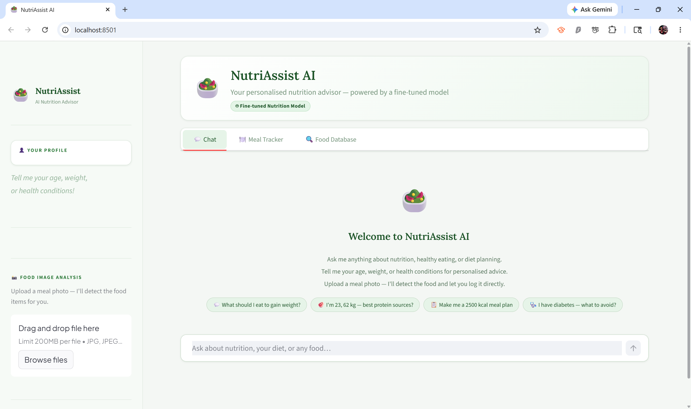
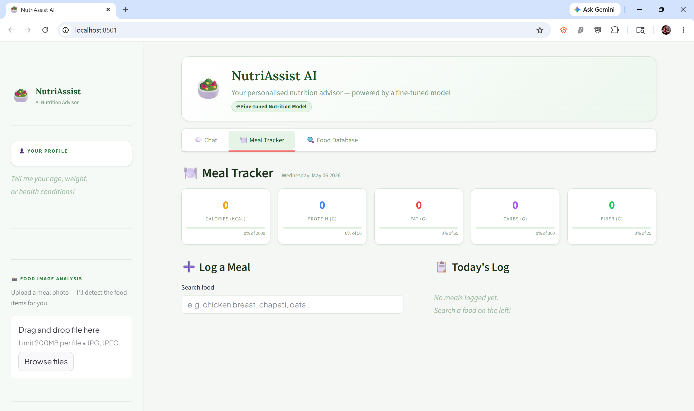
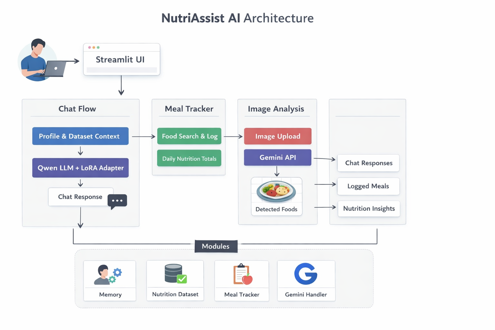

# 🥗 NutriAssist AI

<p align="center">
  
</p>

<p align="center">
  
  
  
  
</p>

---

## 🌟 Overview

NutriAssist AI is a full-stack AI-powered nutrition assistant that combines:

- 🤖 Fine-tuned LLM  
- 📊 Nutrition dataset grounding  
- 🍽️ Meal tracking system  
- 📸 Food image detection  
- 🧠 Session-based memory  

Designed as a **real-world AI product demo**, not just a chatbot.

## 🖼️ Screenshots

### 🖼️ Chat Interface


### 🖼️ Meal Tracker


---

## 🏗️ Architecture




---

## ⚡ Features

### 💬 Smart Nutrition Chat
- Natural conversation with LLM  
- Context-aware responses  
- Uses real nutrition data  

---

### 📊 Dataset Grounding
- Combined nutrition dataset (base + Indian foods)  
- Accurate macro & micro nutrients  

---

### 🧠 Memory System
- Stores user profile (age, weight, goals, conditions)  
- Uses memory only when relevant  

---

### 🍽️ Meal Tracker
- Search foods  
- Add meals (grams or count)  
- Daily nutrition totals  
- Track calories, protein, fat, carbs, and fiber  

---

### 📸 Food Image Detection
- Upload meal images  
- Detect foods via Gemini API  
- Add directly to tracker  

---

### 🎯 Smart UX
- Auto portion suggestions  
- Dynamic quantity handling  
- Clean tab-based interface  
- Live nutrition totals with progress bars  

---

## 🧠 How It Works

The app has two main workflows:

```
💬 Chat Flow:
User Input → Dataset Search → LLM (+ Optional Fine-tuned Adapter) → Grounded Response

🍽️ Tracker Flow:
Search → Preview Nutrition → Add to Log → Daily Totals & Progress
```

### Core Workflow Steps:

1. **User Input** → Natural language question or food search
2. **Nutrition Lookup** → Search `data/nutrients.csv` for matching foods
3. **Context Building** → Inject nutrition facts into prompt
4. **Generation** → LLM responds (with optional LoRA adapter)
5. **Response/Log** → Chat answer or meal added to tracker

**All data stays local.** No cloud APIs required for core features.

---

## 📂 Project Structure

```
NutriAssist-AI/
│
├── App.py                          # Main Streamlit application
├── requirements.txt                # Python dependencies
├── README.md                       # This file
├── .env.example                    # Environment variables template
│
├── assets/                         # Demo images
│   ├── chat.png                   # Chat interface screenshot
│   └── tracker.png                # Meal tracker screenshot
│   └── demo.gif                   # Demo
│   └── architecture.png           # architecture
│
├── data/
│   └── nutrients.csv               # Nutrition dataset (Indian + global foods)
│
├── modules/
│   ├── ai_router.py                # Query routing & LLM integration
│   ├── llama_handler.py            # Model loading & generation
│   ├── nutrition_lookup.py         # Dataset search & context building
│   ├── meal_tracker.py             # Meal logging & tracking logic
│   ├── memory.py                   # User profile & memory management
│   └── gemini_handler.py           # Food image detection integration
│
└── notebook/
    └── Nutrition_Assist_Finetune_Notebook.ipynb  # LoRA fine-tuning workflow
```

---

## ⚙️ Setup

### 1. Install Dependencies

```bash
pip install -r requirements.txt
```

### 2. Configure Environment

Create a `.env` file in the project root:

```env
# Hugging Face
HF_TOKEN=your_huggingface_token_here

# Model Configuration
BASE_MODEL_ID=Qwen/Qwen2.5-3B-Instruct
ADAPTER_MODEL_ID=your_finetuned_adapter_repo_or_leave_blank

# Performance
MODEL_CACHE_DIR=.cache/models
USE_4BIT=true
MAX_INPUT_TOKENS=1200
MAX_NEW_TOKENS=140
```

**Notes:**
- `ADAPTER_MODEL_ID` is optional—leave blank for base model only
- Set `USE_4BIT=true` for lower memory footprint
- Adjust `MAX_*_TOKENS` for faster responses or lower memory use

### 3. Run the App

```bash
streamlit run App.py
```

Default URL: http://localhost:8501

---

## ⚡ Performance

NutriAssist AI runs locally on your device, so hardware significantly impacts user experience:

| Hardware | Experience |
|----------|------------|
| **CPU only** | Slower startup & responses, but fully functional |
| **GPU (8GB VRAM)** | Good speed for chat & tracking |
| **GPU (12GB+ VRAM)** | Fast, smooth, optimal experience |

**Performance Tips:**
- Enable `USE_4BIT=true` in `.env` for memory-efficient inference
- Model caching speeds up subsequent runs
- Meal tracking is always instant (no LLM involved)
- Reduce `MAX_INPUT_TOKENS` and `MAX_NEW_TOKENS` for faster responses
- Use CUDA-enabled GPU for best speed

---

## 🛠️ Troubleshooting

| Issue | Solution |
|-------|----------|
| **Model download fails** | Verify `HF_TOKEN` and Hugging Face model access permissions |
| **Adapter fails to load** | Ensure `ADAPTER_MODEL_ID` is valid PEFT repo, or leave blank for base model |
| **Missing PEFT package** | Run `pip install peft` |
| **Out of memory (OOM)** | Enable `USE_4BIT=true`, reduce token limits, or use smaller model |
| **Slow responses on CPU** | Expected for large models; use GPU or reduce `MAX_INPUT_TOKENS` |
| **Port 8501 already in use** | Run `streamlit run App.py --server.port 8502` |
| **Dataset not found** | Ensure `data/nutrients.csv` exists in project root |

---

## 🧪 Fine-Tuning

Adapt the model to your use case using the included notebook:

```
notebook/Nutrition_Assist_Finetune_Notebook.ipynb
```

**Typical workflow:**
1. Prepare nutrition Q&A examples (your training data)
2. Fine-tune a LoRA adapter on top of the base model
3. Save and publish the adapter to Hugging Face
4. Load it at runtime via `ADAPTER_MODEL_ID` in `.env`

LoRA fine-tuning keeps memory requirements low while improving domain-specific accuracy.

---

## 🎯 Current Focus

- Delivering a seamless, local-first nutrition assistant and meal tracker
- Improving food search, logging, and daily nutrition feedback
- Ensuring the codebase is modular and ready for rapid feature expansion
- Gathering user feedback for real-world nutrition and meal tracking needs

---

## 🔮 Future Enhancements

- 📱 **Mobile-friendly UI:** Responsive design for phones/tablets
- 📤 **Export meal logs:** Download your data as CSV/JSON
- 🧠 **Personalized goals:** User profiles, adaptive nutrition targets
- 📸 **Enhanced image input:** Vision model for food recognition
- 🏆 **Streaks & gamification:** Reminders, achievements, and progress tracking
- 🧩 **Plugin/extensions:** Add-ons for recipes, micronutrients, or custom analytics
- ☁️ **Optional cloud sync:** (future) for multi-device support

---

## 👨‍💻 Author

Developed by **Chinmay Bitne**

---

## 📄 License

MIT License. For the base model (Qwen2.5-3B-Instruct), see: [Qwen License](https://huggingface.co/Qwen/Qwen2.5-3B-Instruct)

---

## ⭐ Support

If you like this project, give it a ⭐
