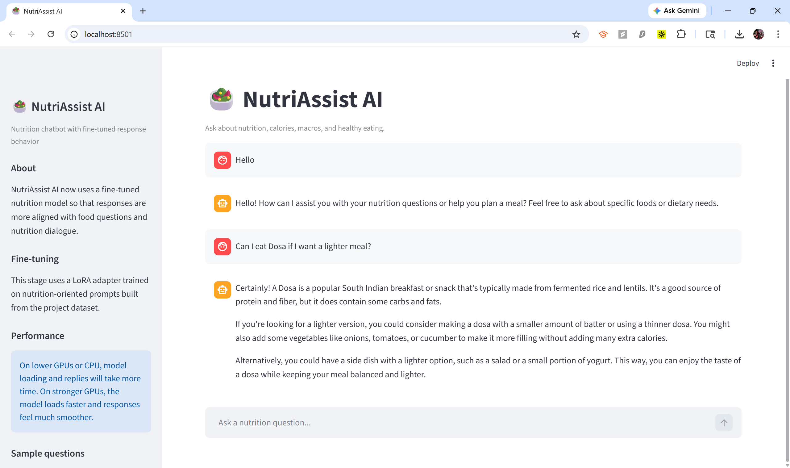

# 🥗 NutriAssist AI

NutriAssist AI is a conversational nutrition assistant that helps users ask questions about food, calories, macros, and general healthy eating.

At this stage, the project integrates a **fine-tuned language model** with a structured nutrition dataset, improving how the system understands and responds to food-related queries.

---

## 🚀 Overview

This project provides:

* 💬 A chatbot interface for nutrition-related questions
* 🤖 Local language model inference
* 🧠 Fine-tuned model for nutrition-focused responses
* 📊 Combined nutrition dataset lookup for factual grounding
* 🇮🇳 Better coverage for Indian dishes and common foods
* ⚡ GPU-friendly inference with optional 4-bit loading
* 🧱 A modular structure ready for future expansion

---

## 🧠 How It Works

The application follows this flow:

```text
User Input → Streamlit UI → AI Router → Dataset Context + Fine-Tuned Model → Response → UI
```

### Core flow

1. The user asks a nutrition-related question
2. The system retrieves matching food data from the dataset
3. Nutrition facts are injected as context
4. A **fine-tuned model** generates a more task-aligned response
5. The response is displayed in the chat interface

---

## 📸 Demo



---

## 🏗️ Architecture

### Main components

* **App.py**

  * Builds the chatbot interface
  * Handles session state and chat history
  * Warms the model once on startup

* **modules/ai_router.py**

  * Routes user queries into the generation pipeline

* **modules/nutrition_lookup.py**

  * Loads the combined nutrition dataset
  * Searches for relevant food items
  * Prepares structured nutrition context

* **modules/llama_handler.py**

  * Loads the base model
  * Loads the fine-tuned LoRA adapter (if provided)
  * Generates final responses

* **notebooks/Nutrition_Assist_Finetune_Notebook.ipynb**

  * Prepares training data
  * Fine-tunes the model using LoRA
  * Saves adapter for inference

---

## 📂 Project Structure

```text
NutriAssist-AI/
│
├── App.py
├── requirements.txt
├── README.md
├── .gitignore
├── .env.example
│
├── data/
│   └── nutrients.csv
│
├── modules/
│   ├── ai_router.py
│   ├── nutrition_lookup.py
│   └── llama_handler.py
│
└── notebooks/
    └── Nutrition_Assist_Finetune_Notebook.ipynb
```

---

## ⚙️ Setup

### 1. Install dependencies

```bash
pip install -r requirements.txt
```

---

### 2. Configure environment

Create a `.env` file using `.env.example`:

```env
HF_TOKEN=your_huggingface_token_here
BASE_MODEL_ID=Qwen/Qwen2.5-3B-Instruct
ADAPTER_MODEL_ID=your_finetuned_adapter_repo_or_leave_blank
MODEL_CACHE_DIR=.cache/models
USE_4BIT=true
MAX_INPUT_TOKENS=1200
MAX_NEW_TOKENS=140
```

---

### 3. Run the app

```bash
streamlit run App.py
```

---

## 🧪 Fine-Tuning

This stage introduces the fine-tuning workflow for improving response quality.

The notebook in:

```text
notebooks/finetuning.ipynb
```

demonstrates how to:

* convert the nutrition dataset into Q&A format
* train a LoRA adapter on top of the base model
* save the adapter for efficient inference

The application supports loading the adapter using:

```env
ADAPTER_MODEL_ID=...
```

---

## 📊 Dataset

This version uses the final cleaned combined nutrition dataset:

```text
data/nutrients.csv
```

The dataset includes:

* base nutrition dataset
* Indian food dataset
* cleaned and deduplicated food entries

It provides structured nutrition values such as:

* calories
* protein
* fat
* saturated fat
* fiber
* carbs
* free sugar
* sodium
* calcium
* iron
* vitamin C
* folate

These values are used to ground responses in factual data.

---

## ⚡ Performance

This project runs a local language model.

* On **lower GPUs or CPU**, startup and responses may take longer
* On **stronger GPUs**, responses are significantly faster and smoother

Optimizations include:

* local model caching
* optional 4-bit quantization
* short context windows
* lightweight dataset retrieval
* adapter-based fine-tuned inference

---

## 🎯 Current Focus

This stage focuses on:

* improving response quality through fine-tuning
* making nutrition conversations more task-aligned
* combining dataset grounding with learned behavior
* maintaining a clean and extensible architecture

---

## 🔮 Future Enhancements

The system is designed to evolve with additional capabilities such as:

* 🍽️ Meal tracking and nutrition analysis
* 📸 Food image detection and understanding
* 🧠 User-aware conversational memory
* ⚡ Faster and more interactive UI

---

## 👨‍💻 Author

Developed by **xdna14**
