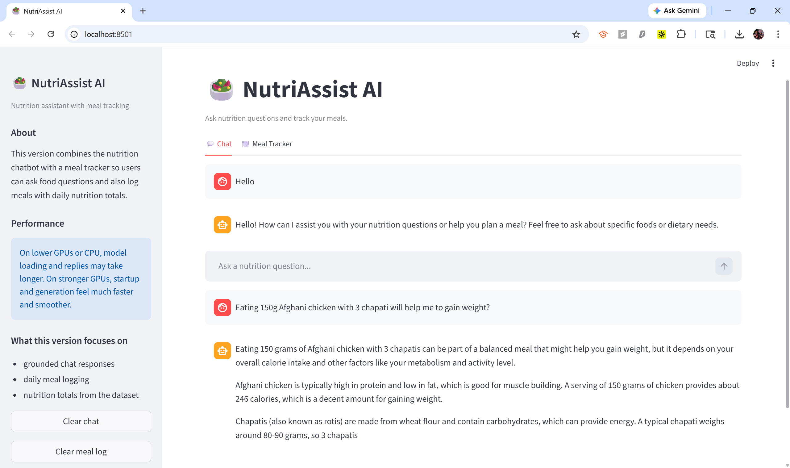
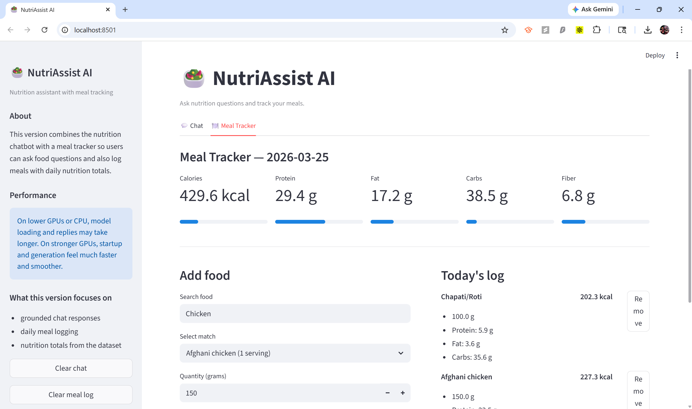

# 🥗 NutriAssist AI (V4)

  

NutriAssist AI is a conversational nutrition assistant and meal tracker. V4 brings together a fine-tuned nutrition chatbot and a practical daily meal logging system—making it a real product for anyone interested in food, macros, and healthy eating.

---

## 🚀 What's New in V4

- 🍽️ **Meal Tracker:** Log foods, track daily calories, protein, fat, carbs, and fiber
- 🔍 **Food Search:** Search and preview nutrition for thousands of foods (Indian + global)
- 🧠 **Fine-tuned Chatbot:** Ask questions, get grounded answers, and practical food advice
- 📊 **Live Nutrition Totals:** See your daily intake vs. goals, with progress bars
- 🧩 **Modular & Extensible:** Clean codebase, ready for more features (image input, export, etc.)
- ⚡ **Fast Local Inference:** GPU/CPU support, 4-bit quantization, and model caching

---

## 🧠 How It Works

The app has two main tabs:

**💬 Chat:**
- Ask nutrition questions in natural language
- Get responses grounded in a real nutrition dataset and fine-tuned model

**🍽️ Meal Tracker:**
- Search foods, preview nutrition, and log meals by quantity (grams)
- Track daily totals for calories, protein, fat, carbs, and fiber
- Remove items or clear your log any time

All data is local—no cloud or external API required for chat or tracking.

---


## 📸 Demo


---


---

## 🏗️ Architecture

**App.py**
- Streamlit UI with two tabs: Chat and Meal Tracker
- Handles session state, chat history, and meal log

**modules/ai_router.py**
- Routes user queries to the model

**modules/llama_handler.py**
- Loads base model and optional fine-tuned adapter
- Handles prompt formatting and generation

**modules/nutrition_lookup.py**
- Loads and searches the nutrition dataset
- Builds context for both chat and tracker

**modules/meal_tracker.py**
- Food search, nutrition preview, meal logging, daily totals, and log management

**data/nutrients.csv**
- Combined, cleaned nutrition dataset (Indian + global foods)

**notebook/Nutrition Assist Finetune Notebook.ipynb**
- Fine-tuning workflow for LoRA adapters

---

## ⚙️ Setup

1. **Install dependencies**

```bash
pip install -r requirements.txt
```

2. **Configure environment**

Create a `.env` file in the project root:

```env
HF_TOKEN=your_huggingface_token_here
BASE_MODEL_ID=Qwen/Qwen2.5-3B-Instruct
ADAPTER_MODEL_ID=your_finetuned_adapter_repo_or_leave_blank
MODEL_CACHE_DIR=.cache/models
USE_4BIT=true
MAX_INPUT_TOKENS=1200
MAX_NEW_TOKENS=140
```

3. **Run the app**

```bash
streamlit run App.py
```

Default: [http://localhost:8501](http://localhost:8501)

---

## 🛠️ Troubleshooting

- **Model download fails:** Check `HF_TOKEN` and Hugging Face access
- **Adapter fails to load:** Check `ADAPTER_MODEL_ID` or leave blank for base model
- **Missing PEFT:** `pip install peft`
- **Out of memory:** Use 4-bit, reduce tokens, or try a smaller model
- **Slow on CPU:** Use a CUDA GPU or smaller model
- **Port in use:** `streamlit run App.py --server.port 8502`

---

## 📂 Project Structure

```text
NutriAssist-AI/
|
|-- App.py
|-- requirements.txt
|-- README.md
|-- .env.example
|-- assets/
|   |-- Demo1.png
|   |-- Demo2.png
|   |-- Demo.png
|-- data/
|   |-- nutrients.csv
|-- modules/
|   |-- ai_router.py
|   |-- llama_handler.py
|   |-- nutrition_lookup.py
|   |-- meal_tracker.py
|-- notebook/
|   |-- Nutrition Assist Finetune Notebook.ipynb
```


## ⚡ Performance

NutriAssist AI runs a local LLM and all meal tracking logic on your device. Performance depends on your hardware:

- **Minimum:** 8GB RAM, CPU (slower responses, but works for chat and tracking)
- **Recommended:** CUDA-capable GPU (NVIDIA), 12GB+ VRAM for smoothest experience
- **Optimizations:**
	- 4-bit quantization for lower memory usage
	- Model and dataset caching for faster startup
	- Short conversation history for quick inference
	- Efficient food search and logging (instant, even on large datasets)

**Tips:**
- On CPU, expect slower model responses (meal tracking is always instant)
- On GPU, responses are fast and smooth
- Reduce `MAX_INPUT_TOKENS` and `MAX_NEW_TOKENS` in `.env` for lower memory use

---

## 🎯 Current Focus

- Delivering a seamless, local-first nutrition assistant and meal tracker
- Improving food search, logging, and daily nutrition feedback
- Ensuring the codebase is modular and ready for rapid feature expansion
- Gathering user feedback for real-world nutrition and meal tracking needs

---

## 🔮 Future Enhancements

- 📱 **Mobile-friendly UI:** Responsive design for phones/tablets
- 📤 **Export meal logs:** Download your data as CSV/JSON
- 🧠 **Personalized goals:** User profiles, adaptive nutrition targets
- 📸 **Food image input:** Vision model for food recognition
- 🏆 **Streaks & gamification:** Reminders, achievements, and progress tracking
- 🧩 **Plugin/extensions:** Add-ons for recipes, micronutrients, or custom analytics
- ☁️ **Optional cloud sync:** (future) for multi-device support

---

## 👨‍💻 Author

Developed by **Chinmay Bitne**

---

## 📄 License

MIT License. For the base model (Qwen2.5-3B-Instruct), see: [Qwen License](https://huggingface.co/Qwen/Qwen2.5-3B-Instruct)

